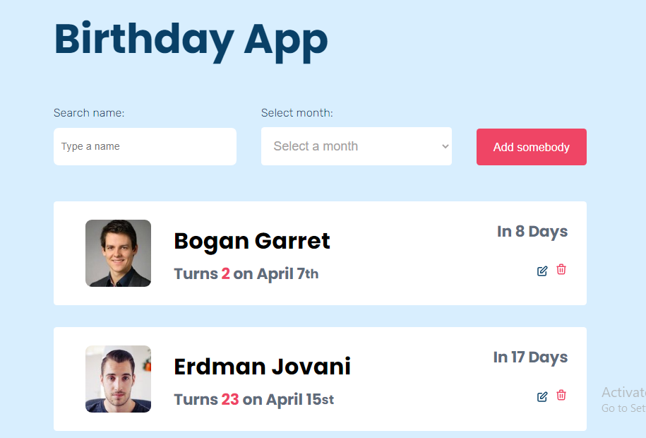
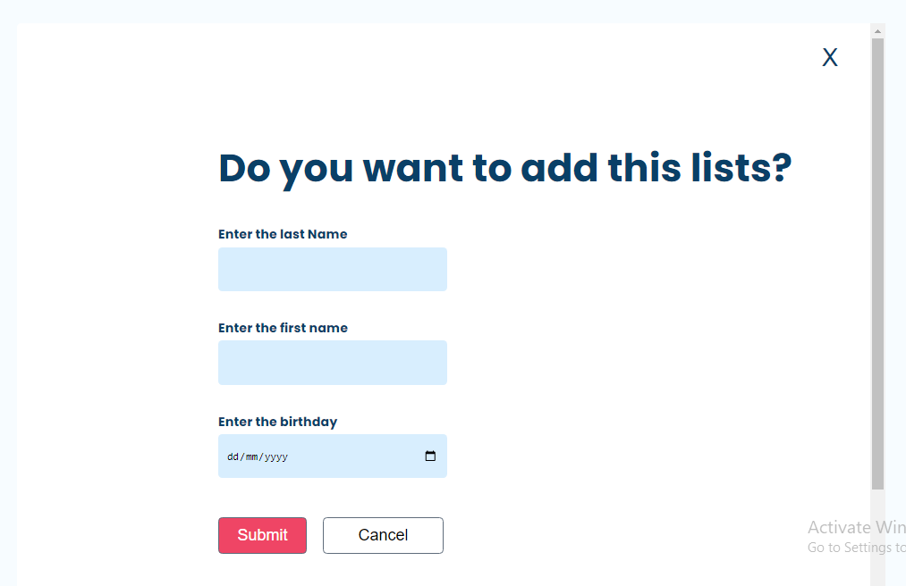
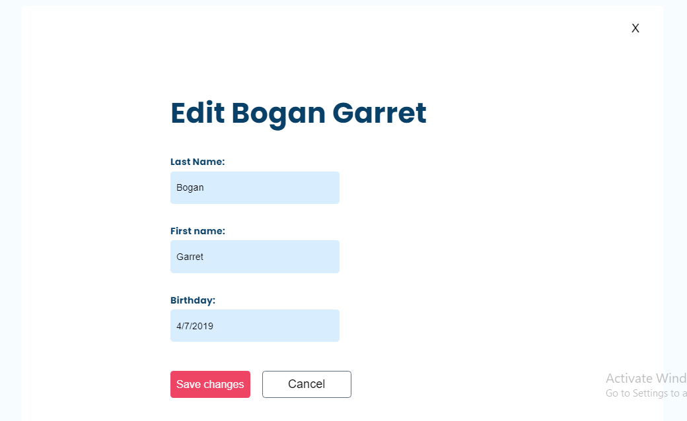
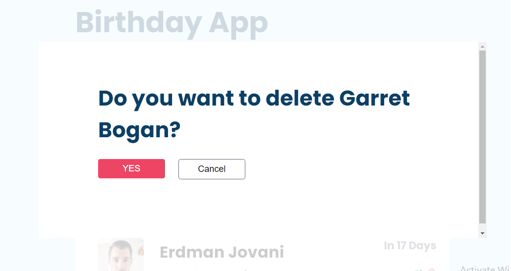

#  **Birthday App Project**

## Design 

You can see the design [here](https://birthday-app-petah.netlify.app)

## **Feature**
1- The first site


2- After clicking the add someone button


3- When you click on the edit button


4- After clicking the delete button



### **Structure**
In this project, I create a birthday application with pure vanilla Javascript. This app will show us whose person is the closest to have their birthday. These are the steps that I did:

1- I created a fetch function to fetch all the people's birthday from the people.json file by using an async function.

2- I pushed the lists of the people and displayed it in one function.

3- I created an add function to handle the adding lists so that the users can add the list of people's birthday.

4- To handle the two buttons edit and delete, I created two functions within html each followed by form in a modal. So when you click on the buttons, the form will appear and you can choose whether you are sure to delete and to edit or to cancel it.

5- The destroy function is to handle the break when any clicking actions are finished.

6- I have local storage function to store all the lists in the browser.

### **Something I learned**

- I learned how to count people birthday from they born till today and the next birthday in Javascript. 
- I learned how to search a list by names and search the list by the month at the same time using filter.

### **Most challenge**

The most challege that I faced were:
- Counting the birth date by Javasript
- Deleting and editing the added person that is added by the users and storing them in the local storage.
- Refactoring the codes. I struggled to get the result variable works properly. It threw an error that needs to use "let" instead of "const".


### **More improvement needed**

- To access the npm of date like using <a>date.fns</a>
- To use the css framework like <a>bootstrap</a>
- The use of <a>BEM</a>


## **Built With**

-   [Vanilla Javascript](https://vanilla.js.org/)

## **How To Use**

<!-- Example: -->

To clone and run this application, you'll need [Git](https://git-scm.com) and [Node.js](https://
nodejs.org/en/download/) (which comes with [npm](http://npmjs.com)) installed on your computer. 
From your command line:

```bash
# Clone this repository
$ git clone https://github.com/your-user-name/your-project-name

# Install dependencies
$ npm install

# Run the app
$ npm start
```

## **Contact**

-   Website [my-website.com](https://birthday-app-petah.netlify.app)
-   GitHub [@mygithub-account](https://github.com/Tiaraha-funny/birthday-app)
-   Email [@my-email-adress](mailto:peta.jea@onja.org)